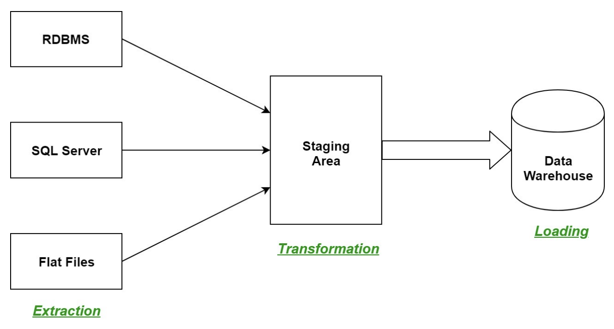
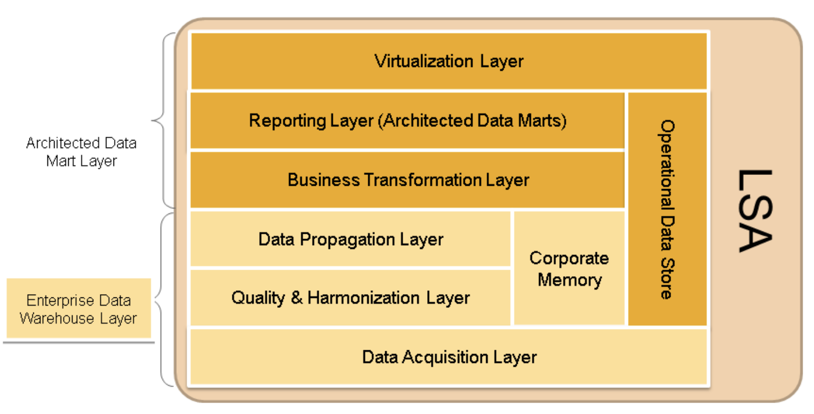

# DATA WAREHOUSE

## Background and concept : by talend

- A data warehouse is a large collection of business data used to help an organization make decisions.
  - 데이터 웨어하우스는 기업의 의사결정을 돕기 위한 비즈니스 데이터의 큰 단위이다.
- The concept of the data warehouse has existed since the 1980s, when it was developed to help transition data from merely powering operations to fueling decision support systems that reveal business intelligence.
  - 데이터 웨어하우스 개념은 1980년대부터 존재해왔다.
  - 이 때는 단순한 운영으로부터 비즈니스 인텔리전스를 드러내는 fueling 결정 지원 시스템으로 데이터를 전환하기 위한 개념이었다.
- The large amount of data in data warehouses comes from different places such as internal applications such as marketing, sales, and finance; customer-facing apps; and external partner systems, among others.
  - 데이터 웨어하우스의 거대한 데이터는 마케팅, 세일즈, 금융, 고객 응대 앱, 외부 파트너 시스템 등 여러 군데로부터 쌓인다.
- On a technical level, a data warehouse periodically pulls data from those apps and systems
  - 기술적 수준에서, 데이터 웨어하우스는 앱들과 시스템들로부터 정기적으로 데이터를 pull한다.
- then, the data goes through formatting and import processes to match the data already in the warehouse.
  - 그리고 그 데이터는 formatting을 거쳐, 웨어하우스에 이미 있는 데이터와 match되기 위한 프로세스에 투입된다.
- The data warehouse stores this processed data so it's ready for decision makers to access.
  - 데이터 웨어하우스는 이렇게 처리된 데이터를 저장하고, 의사 결정자들이 접근할 수 있게 준비한다.
- How frequently data pulls occur, or how data is formatted, etc., will vary depending on the needs of the organization.
  - 얼마나 데이터 pull이 자주 발생하는지나, 데이터가 어떻게 format될지 등은 조직의 요구사항에 따라 다양할 것이다.

## Data Warehouse: Basic concept and architecture

- Data Warehouse is a conventional big data analytics system.
  - 데이터 웨어하우스는 전통적인 빅데이터 분석 시스템이다.
- But it is the most important and useful IT infrastructure for big data applications until now.
  - 그러나 이것은 지금까지 빅데이터 애플리케이션에 있어 가장 중요하고 유용한 IT 인프라이다.

## Data Warehouse: ETL and ELT on the data warehouse : by databrics

- ETL (Extract, Transform, Load) and ELT (Extract, Load, Transform) are two different ways of transforming data.
- Data engineers oftn use ETL, or extract-transform-load, to extract data from differenct data sources and move it into the data warehouse, where they can easily cleanse and structure it.
- ELT, on the other hand, loads data into the warehouse in its original format first, and cleanses and structures it as it is processed.

- ETL is typically done more celtrally via Enterprise Data Engineering teams to apply company-wide data cleasing and conforming rules.
- ELT implies transformations are done at a later stage which are typically more project/business team specific - to enable self-service analytics.

## Data Warehouse: ETL process in data warehouse

1. Extraction
   - The first step of the ETL process is extraction.
   - In this step, data from various source systems is extracted which can be in various formats like relational databases, No SQL, XML, and flat files into the staging area.
   - It is important to extract the data from various source systems and store it into the staging area first and not directly into the data warehouse
   - because the extracted data is in various formats and can be corrupted also.
   - Hence loading it directly into the data warehouse may damage it and rollback will be much more difficult.
   - Therefore, this is one of the most important steps of ETL process.

2. Transformation
   - The second step of the ETL process is transformation.
   - In this step, a set of rules or functions are applied on the extracted data to convert it into a single standard format.
   - It may involve following processes/tasks
     - Filtering : loading only certain attributes into the data warehouse.
     - Cleaning : filling up the NULL values with some default vaules.
       - ex) mapping U.S.A, United States, and America into USA, etc.
     - Joining : joining multiple attributes into one.
     - Splitting : splitting a single attribute into multiple attributes.
     - Sorting : sorting tuples on the basis of some attribute (generally key-attribute)

3. Loading
   - The third and final step of the ETL process is loading.
   - In this step, the transformed data is finally loaded into the data warehouse.
   - Sometimes the data is updated by loading into the data warehouse very frequently and sometimes it is done after longer but refular intervals.
   - The rate and period of loading solely depends on the requirements and varies from system to system.

## Data Warehouse: What are data warehouses used for? : by databricks

- Data warehouses are used in BI, reporting, and data analysis to extract and summarize data from operational databases.
- Information that is difficult to obtain directly from transactional databases can be obtained via data warehouses.
- For example, management wants to know the total revenues generated by each salesperson on a monthly basis for each product category.
- Transactional databases may not capture this data, but data warehouse does.

## Data Warehouse: Benefits of data warehouses : by databricks

- Consolidate data obtained from many sources
  - acting as a single point of access for all data, rather than requiring users to connect to dozens or even hundreds of individual data stores.
- Historical intelligence
  - A data warehouse integrates data from many sources to show historic trends.
- Separate analytics processing from transactional databases
  - improving the performance of both systems.
- Data quality, consistency, and accuracy
  - Data warehouses use a standard set of semantics around data, including consistency in naming conventions, codes for various product types, languages, currencies, and so on.

## Data Warehouse: Challenges with data warehouse : by databricks

1. `No support for unstructured data` (like images, text, IoT data, or messaging frameworks like HL7, JSON, and XML)
   - Tranditional data warehouses are only capable of storing clean and highly structured data, even though Gartner estimates that upto 80% of an organization's data is unstructured.
   - Organizations that want to use their unstructured data to unlock the power of AI have to look elsewhere.
2. `No support for AI and machine learning`
   - Data warhouses are purpose-built and optimized for common Data warehouse workloads including historical reporting, BI, and querying
   - they were never designed for or intended to support machine learning workloads.
3. `SQL-only`
   - Data warehouses typically offer no support for Python or R, the languages of choice for app developers, data scientists, and machine learning engineers.
4. `Duplicated data`
   - Many enterprises have data warehouses and subject-area or (departmental) data marts in addition to a data lake, which results in duplicated data, lots of redundant ETL, and no single source of truth.
5. `Tough to keep in sync`
   - Keeping two copies of the data synchronized between the lake and the warehouse adds complexity and fragility that is tough to manage.
   - Data drift can cause inconsistent reporting and faulty analysis.
6. `Closed, proprietary formats increase vendor lock-in`
   - most enterprise data warehouses use their own proprientary data format, rather than formats based on open source and open standards.
   - This increases vendor lock-in, makes it difficult or impossible to anlyze your data with other tools, and makes it more difficult to migrate your data.
7. `Expensive`
   - Commercial data warehouses charge you for storing your data, and also for analyzing it.
   - Storage and compute costs are therefore still tightly coupled tohether.
   - Seperation of compute and storage with a big data platform means you can independently scale either as needed.

## Data Warehouse: The future of the data mart (cloud) : by IBM

- While data marts offer businesses the benefits of greater efficiency and flexibility, the unstoppable growth of data poses a problem for companies that continue to use an on-premises solution.
- As data warehouses move the cloud, data marts will follow.
- By consolidating data resources into a single repository that contains all data marts, businesses can reduce costs and ensure all departments have unfettered access to data they need in real-time.
- Cloud-based platforms make it possible to create, share, and store massive data sets with ease, paving the way for more efficient and effective data access and analysis.
- Cloud systems are built for sustainable business growth, with many modern Software-as-a Service(SaaS) providers separating data storage from computing to improve scalability when querying data.

## Data Warehouse: LSA (Layered Scalable Architecture)

### Enterprise Data Warehouse Layer
    
    The Enterprise Data Warehouse layer consists of the data acquisition layer, the quality and harmonization layer, the data propagation layer and the corporate memory.

- `Data Acquistion Layer`
  - The data acquisition layer allows data to be physically integrated into DW.
  - The layer receives the data from the source and distributes it in the DW system.
  - The layer allows you to fill all targets separately from each other, and even at differenct times.

- `Quality and Harmonization Layer`
  - In the quality and harmonization layer, the data is transformed, standardized and stored in data store objects.
  - The level of transformation required here depends on how different the sources are that the data comes from.
  - No transformations are performed here that affect the business logic.

- `Data Propagation Layer`
  - The data propagation layer serves the applications.
  - This should happen as quickly as possible, which is why you have the option of semantic partitioning in this layer.
  - The data is stored and consolidated in DataStore objects.
  - The data propagation layer provides a basis for further distribution and reuse of data.

- `Corporate Memory`
  - The Corporate Memory is filled (separately from the update) in the architected data marts.
  - It contains the complete history of the loaded data.
  - It can be used as a source for reconstructions, without needing to access the sources again.

### Architected Data Mart Layer

    The Architected Data Mart layer consists of the Business Transformation layer, the Reporting layer and the Virtualization layer.

- `Business Transformation Layer`
  - In the Business Transformation layer, the data is transformed based on business logic.
  - The data in the previous layer (Data Propagation layer) should not be transformed based on business logic, to ensure that the data can be used again.
  - It may be the case that data store objects in this layer are needed to compile data from several data store objects in the Data Propagation layer.

- `Reporting Layer`
  - The Reporting layer contains the objects that are used to perform queries for analysis.
  - This layer is modeled mainly using BI tools and data cubes (e.g. SAP infoCubes).
  - These cubes save data in Business warehouse accelerator.
  - To improve the database performance, you can semantically partition the data cubes.
  - Special data cubes enable you to create planning scenarios here.
  - Using this data cube as a basis, you can create data views (in the form of agregation levels) and methods to change data (for example, planning functions and planning sequences).
  - Virtual providers allow you to access source data directly.
  - Different composite objects (e.g. HybridProviders, InfoSets) provide benefits for analysis.

- `Virtualization Layer`
  - Queries should always be defined on a multi-provider for reasons of flexibility
  - These queries form the Virtualization layer.

- `Operational Data Store`
  - The Operational Data Store supports operative data analysis.
  - Data can be updated to an operational data store, on a continual basis or in short intervals, and the read for operative analysis.
  - You can also forward the data from the Operational Data Store layer to the data warehouse layer at set times.
  - This means that the data is stored in different levels of granularity.
  - For example, whereas the Operational Data Store layer contains all the changes to the data, only the day-end status is stored in the data warehouse layer.